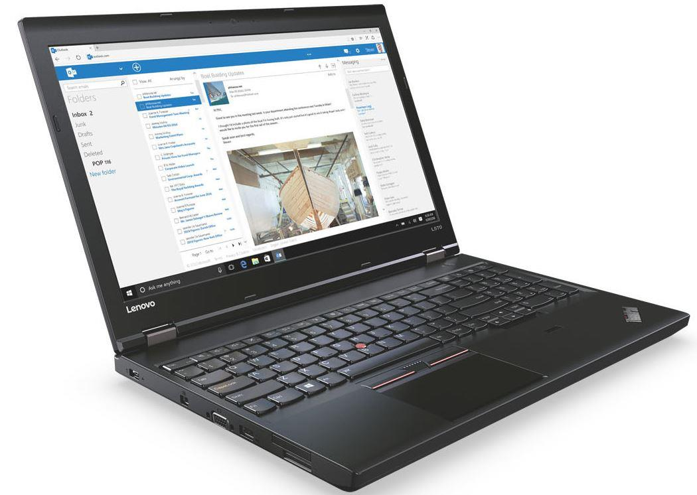
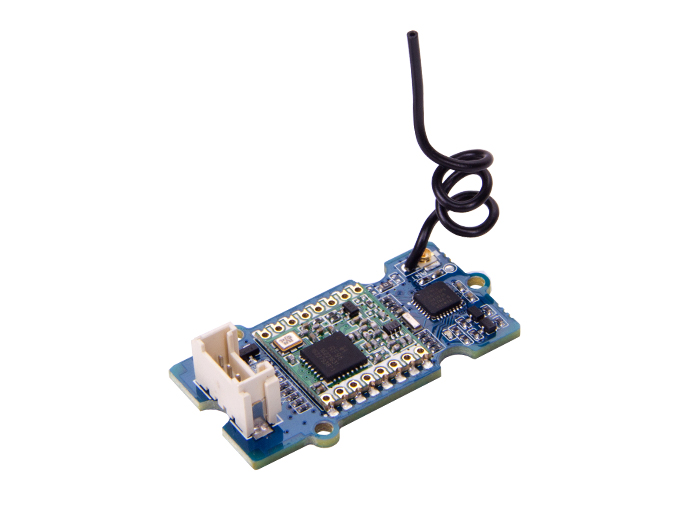

# EBikes-IoT
## Description
Currently in cities, to analyze and report on meteorological data, electronic devices are implanted in the upper part of structures, such as traffic lights. However, in addition to losing precision due to their high locations, these solutions do not promote citizens' environmental awareness. Therefore, the purpose of this project is to create a mobile and cost-effective weather station using Bilbao electric bicycles belonging to Bilbao Bizi. These vehicles will increase coverage, while helping to promote environmental awareness. In this way, our project aims to complement the current weather system, improving accuracy, and adding a social factor.

The system is divided into three main parts. On the one hand, it consists of the bicycles that will be used as receivers of the weather station. These vehicles will be constantly collecting weather, noise and pollution data, and will decide when they are able to send the data to the central station. For this, the bicycles will incorporate a Raspberry Pi with temperature, humidity, gas and noise sensors.

On the other hand, in the city there will be a base station located at a fixed point. When the bicycles are within the range of this station, the data will be transmitted through LoraWan technology. When the central station receives this data, it will be stored in a remote temporary database. Therefore, the base will be responsible for managing connections with bicycles, receiving their data, and forwarding them for later storage and processing.

Finally, a web application will be made available to the BilbaoBizi entity that will show a map with the real-time tracking of their vehicles and the information they obtain, in this case the temperature, humidity, noise and pollution.

## Code
The code of the project is in the folder [ebikes](ebikes):
- [storage.py](ebikes/storage.py): module for sending data from the weather station to the remote dashboard. It uses the MQTT protocol.
- [sensors.py](ebikes/sensors.py): module for using all the Gas/Loudness/Temperature/Humidty sensors. We have abstract them into classes.
- [protocol.py](ebikes/protocol.py): module for defining how the data is sent and parsed between the data-collector and the weather station.
- [lora](ebikes/lora): package containing all the lora related modules
    - [lora.py](ebikes/lora/lora.py): Lora module abstraction for reading and writing data
    - [rfm](ebikes/lora/rfm): Package containing the code that we found online for using the Lora Arduino module with the Raspberry Pi. The original repository is [https://github.com/erazor83/pyRFM](https://github.com/erazor83/pyRFM)
- [fake_gps](ebikes/fake_gps): Package containing the fake GPS class. It works by reading a CSV with more than a hundred coordinates. Theses coordinates can be found in [gps-data](gps-data). We used the online tool in [https://nmeagen.org/](https://nmeagen.org/) for generating a CSV with a route that simulates a bike. 

There are also the two main executables, one for the client and one for the server.
- [client_main.py](client_main.py): Main for the bicycle weather station. First it activates all the sensors, and then it starts a loop, that every X unit of times, retrieves data from the sensors and send it through its Lora module.    
- [server_main.py](server_main.py): Main for the central weather station. It runs a loop that is waiting for a message in the Lora module, and when it receives it, it send it to the remote Dashboard. 

Finally, there are two scripts in the folder [scripts](scripts), that we have used them for deploying ThingsBoard using Docker.
- [docker-thingsboard.sh](scripts/docker-thingsboard.sh): Script for launching ThingsBoard on Docker
- [create-telemetries.sh](scripts/create-telemetries.sh): Script for initializing the sensors telemetries

## Dashboard
For visualizing all the data, we have chosen ThingsBoard. We have decided to deploy it in a personal laptop. The communication between the central weather station and ThingsBoard is done using MQTT.

### Data Interpretation

- **Temperature**: It returns the value in celsius degrees.
- **Humidty**: It returns the value in percent.
- **Gas**: It returns a value between 0 and 10. the lower the value, the higher the gas concentration. But for calculating the value, there needs to be a prior calculation of the "normal" gas value. 

    Next, it is shown the chart that explains in more detail:

- **Loudness**: It returns a value between 0-1023. The higher the value, the louder it is.

## Hardware
### Weather stations and servers
Weather stations that will be attached to bicycles will use a Raspberry Pi 3 model B. Compared to other solutions, the Raspberry Pi offers a very low cost, a simple and familiar environment for coding and a great ease of extending its functionality.

As a central server where the dashboard will be deployed, a common laptop will be used, with minimum specifications: 8 GB of RAM, 256 GB of SSD and capacity for gigabit-ethernet.

### Sensors and actuators
- **Gas sensor**: We will use a sensor capable of recognizing gases such as carbon monoxide or benzene that are quite dangerous.

- **Loudness sensor**: Sensor used to measure the amount of noise in the receiver.

- **Temperature and humidity sensor**: A sensor capable of indicating the Celsius greased temperature. And a second sensor capable of indicating the humidity there is.

- **GPS module**: Instead of using a real GPS module, we have simulated it by software. This is because a GPS module uses the Serial port, the same as Lora's module, and the Raspberry only has one Serial port.

### Communication technologies used to send data
The technology used to make the connection between the weather stations and the LoraWan server will be. This technology is used for low consumption and wide area networks (range greater than 10 kilometers). To use this technology, a LoraWan module is necessary.
